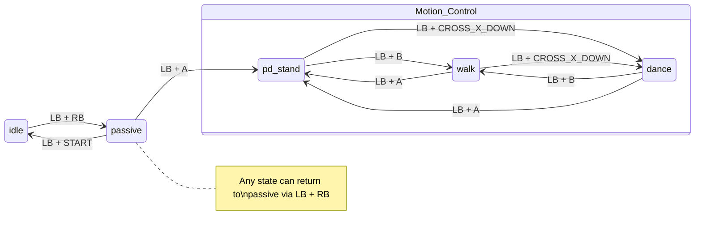

# EngineAI Native SDK: Native Control Framework for Humanoid Robots

[中文](README_CN.md) | English

## Overview

This repository provides the EngineAI Native Control SDK, designed for humanoid robot application development and system integration. It delivers a lightweight, easily deployable control and task execution framework with strong extensibility. Through standardized interfaces and modular architecture, the SDK significantly reduces the complexity of secondary development and functional integration, allowing developers to focus on algorithm research and application implementation.

To support robot algorithm development, simulation verification, and real-robot deployment, the repository provides a complete runtime framework and simulation-deployment toolchain. Core modules include:

- **High-Performance Precompiled Scheduling Framework** — Provides a high-performance scheduling mechanism for real-time robot control and inference tasks. Precompilation optimizations reduce runtime overhead and improve overall system execution efficiency and stability.
- **Configuration-Driven Task Orchestration System** — Employs a configuration-based task orchestration approach for flexible organization of algorithm modules, control flows, and data pipelines, enabling rapid adjustment of experiment workflows and system operating strategies.
- **Extensible Model and Parameter Management System** — Provides unified interfaces for model loading, version management, and parameter configuration, facilitating centralized management and iteration of algorithm models, control parameters, and experiment configurations.
- **Modular Business Plugin Mechanism** — Based on a plugin architecture that supports flexible extension and decoupling of perception, planning, and control modules, enabling rapid integration of new algorithms and features.
- **Mujoco Simulation and Real-Robot Deployment Toolchain** — Provides a complete Mujoco simulation environment and real-robot deployment scripts, supporting fast migration from simulation verification to real robot systems.

Additionally, the repository includes URDF and other robot model files that are consistent with the real robot hardware structure, used for simulation environment construction, kinematics/dynamics computation, and algorithm verification, ensuring good consistency between simulation results and real systems.

## Repository Structure

```
native_sdk/
├── assets/              # Resource files (models, configs, etc.)
│   └── config/          # Robot-specific configuration files
├── core/                # Core framework library
├── docker/              # Container environment scripts
│   └── generate.sh      # Generate container dev environment
├── scripts/             # Utility scripts (simulation build/run, etc.)
├── simulation/          # Mujoco simulation module
├── src/                 # Application source code
│   ├── runner/          # Motion control modules (Runner plugins)
│   ├── executor/        # Executor module
│   └── data/            # Data processing module
├── build.sh             # Build script
├── run.sh               # Run script
└── install.sh           # Real-robot deployment script
```

---

## 1. Development Environment & Quick Start

### 1.1 Container Environment

Generate the container development environment. Upon completion, a shortcut entry `engineai_robotics_env` will be created:

```bash
cd native_sdk
./docker/generate.sh
```

Open a new terminal and enter the development environment using the shortcut command:

```bash
engineai_robotics_env
```

### 1.2 Build

```bash
# Enter the container
engineai_robotics_env

# Build
./build.sh
```

### 1.3 Run

```bash
# Enter the container
engineai_robotics_env

# Run with default robot model
./run.sh

# Run with a specific robot model
./run.sh pm01_edu
```

### 1.4 State Switching

After program startup, the robot switches between different motion states via remote controller commands. The Native SDK uses a **Finite State Machine (FSM) mechanism**:

- Each motion state defines explicit entry conditions and allowed state transitions. The system only permits state switching when conditions are met, ensuring the safety and stability of robot motion control.

#### System Startup

After executing `./run.sh` or `./run_robot.sh`, the system enters the **idle** state by default. `idle` is the initial safe state after the robot is powered on — the controller does not activate active motion control.

#### State Transition Overview

| Current State | Allowed Target State | Trigger Keys | Description |
|:-------------:|:--------------------:|:------------:|:------------|
| idle | passive | LB + RB | Transition from inactive to damping state |
| passive | idle | LB + START | Return to inactive state |
| passive | pd_stand | LB + A | Enter stable standing control task |
| pd_stand | walk | LB + B | Enter walking task after stable standing |
| pd_stand | dance | LB + CROSS_X_DOWN | Enter dance task after stable standing |
| walk | pd_stand | LB + A | Return to stable standing from walking |
| walk | dance | LB + CROSS_X_DOWN | Switch from walking to dance task |
| dance | pd_stand | LB + A | Return to stable standing from dance |
| dance | walk | LB + B | Switch from dance to walking task |

#### State Flow Diagram



#### Global Safety Mechanism (Emergency Fallback)

> **Any state** can be forcefully switched to `passive` via **`LB + RB`**.

This functions as a **Soft Emergency Stop**:

- Immediately terminates the current motion control logic
- Returns the system to a safe passive state
- Critical for debugging and real-world operation — reduces the risk of motion control runaway

### 1.5 Mujoco Simulation

#### 1.5.1 Build

```bash
# Enter the container
engineai_robotics_env

# Build the simulation module
./scripts/build_mujoco.sh
```

#### 1.5.2 Run

> Before running, ensure that `active_mode` is set to `sim` in `assets/config/<robot>/mode.yaml`.

```bash
# Enter the container
engineai_robotics_env

# Run simulation (default robot model)
./scripts/run_mujoco.sh

# Run with a specific robot model
./scripts/run_mujoco.sh pm01_edu
```

After launching, use the remote controller to switch states.

#### 1.5.3 Improving Simulation Performance

If you have a dedicated NVIDIA GPU with proper drivers installed, you can enable GPU passthrough in Docker to improve simulation rendering frame rates.

**Step 1: Install the NVIDIA Docker Toolkit**

```bash
curl -fsSL https://nvidia.github.io/libnvidia-container/gpgkey \
  | sudo gpg --dearmor -o /usr/share/keyrings/nvidia-container-toolkit-keyring.gpg \
  && curl -s -L https://nvidia.github.io/libnvidia-container/stable/deb/nvidia-container-toolkit.list \
  | sed 's#deb https://#deb [signed-by=/usr/share/keyrings/nvidia-container-toolkit-keyring.gpg] https://#g' \
  | sudo tee /etc/apt/sources.list.d/nvidia-container-toolkit.list

sudo apt-get update
sudo apt-get install -y nvidia-container-toolkit

sudo nvidia-ctk runtime configure --runtime=docker
sudo systemctl restart docker
```

**Step 2: Enable GPU Passthrough**

Set `NVIDIA_GPU_AVAILABLE` to `y` in `docker/generate.sh`:

```bash
NVIDIA_GPU_AVAILABLE=y
```

**Step 3: Regenerate the Container Environment**

```bash
./docker/generate.sh
```

After restarting the container, GPU-accelerated rendering will be available.

---

### 1.6 Real-Robot Deployment

#### 1.6.1 Configure Deployment Target

Edit the deployment target parameters in `install.sh`:

```bash
remote_user="user"
remote_host="192.168.0.163"
remote_dir="~/projects/engineai_robotics"
```

Execute the installation:

```bash
cd native_sdk

# ./install.sh <robot_model> <mode>
./install.sh pm01_edu robot
```

#### 1.6.2 Running on the Real Robot

> [!CAUTION]
> **Safety Notice:**
> - Ensure all personnel maintain a safe distance from the robot
> - If the robot behaves abnormally, stop it immediately (press the emergency stop button or switch to `passive` mode)
> - It is recommended to suspend the robot on a gantry first. After entering `pd_stand` mode, lower it to the ground before switching to walking mode

**Pre-run Preparation:**

1. Enable the robot's motor system using the emergency stop remote controller
2. Connect to the robot's hotspot or use an Ethernet cable to connect to the robot

**Startup Steps:**

```bash
# SSH into the robot (Nezha)
ssh user@192.168.0.163

# Stop the auto-started motion control service
sudo systemctl stop robotics.service

# Launch native_sdk
cd ~/projects/engineai_robotics
sudo ./run_robot.sh pm01_edu
```

**Running in Background:**

```bash
nohup sudo ./run_robot.sh pm01_edu > nohup.out 2>&1 &
tail -f nohup.out
```

After launching, use the remote controller to switch actions as described in [State Switching](#14-state-switching).

## License

This project is licensed under the [BSD 3-Clause License](LICENSE.txt).