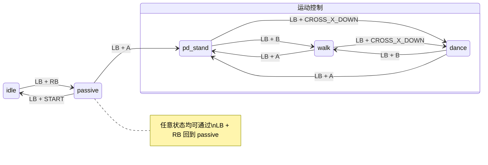

# EngineAI Native SDK：人形机器人原生控制开发框架

中文 | [English](README.md)

## 概述

本仓库为 EngineAI 机器人原生控制 SDK，面向人形机器人应用开发与系统集成，提供轻量化、易部署且具备良好扩展能力的控制与任务运行框架。该 SDK 通过标准化接口与模块化架构设计，有效降低机器人系统二次开发与功能集成的复杂度，使开发者能够更加专注于算法研发与应用功能实现。

为支持机器人算法开发、仿真验证及真机部署，仓库提供完整的运行框架与仿真部署工具链，核心模块包括：

- **高性能预编译调度框架** —— 提供面向机器人实时控制与推理任务的高性能调度机制，通过预编译优化降低运行时开销，提升系统整体执行效率与稳定性。
- **配置驱动的任务编排系统** —— 采用配置化任务编排方式，实现算法模块、控制流程与数据流的灵活组织，支持快速调整实验流程与系统运行策略。
- **可扩展的模型与参数管理体系** —— 提供统一的模型加载、版本管理与参数配置接口，便于算法模型、控制参数及实验配置的集中管理与迭代。
- **模块化业务插件机制** —— 基于插件化架构设计，支持感知、规划、控制等功能模块的灵活扩展与解耦，便于新算法或新功能的快速集成。
- **Mujoco 仿真与真机部署工具链** —— 提供完整的 Mujoco 仿真环境与真机部署脚本，支持从仿真验证到真实机器人系统的快速迁移与部署。

此外，仓库还包含与真实机器人硬件结构保持一致的 URDF 等机器人模型文件，用于仿真环境构建、运动学/动力学计算以及算法验证，确保仿真结果与真实系统具有良好一致性。

## 仓库结构

```
native_sdk/
├── assets/              # 资源文件（模型、配置等）
│   └── config/          # 机型配置文件
├── core/                # 核心框架库
├── docker/              # 容器环境相关脚本
│   └── generate.sh      # 生成容器开发环境
├── scripts/             # 辅助脚本（仿真编译/运行等）
├── simulation/          # Mujoco 仿真模块
├── src/                 # 业务源码
│   ├── runner/          # 运动控制模块（Runner 插件）
│   ├── executor/        # 执行器模块
│   └── data/            # 数据处理模块
├── build.sh             # 编译脚本
├── run.sh               # 运行脚本
└── install.sh           # 真机部署脚本
```

---

## 1. 开发环境与快速开始

### 1.1 容器环境

生成容器开发环境，执行完成后会生成快捷入口 `engineai_robotics_env`：

```bash
cd native_sdk
./docker/generate.sh
```

启动一个新终端，通过快捷命令即可进入开发环境：

```bash
engineai_robotics_env
```

### 1.2 编译

```bash
# 进入容器
engineai_robotics_env

# 执行编译
./build.sh
```

### 1.3 运行

```bash
# 进入容器
engineai_robotics_env

# 运行默认机型
./run.sh

# 指定机型运行
./run.sh pm01_edu
```

### 1.4 状态切换说明

程序启动后，机器人通过遥控器指令在不同运动状态之间切换。Native SDK 的运行模式采用 **有限状态机（FSM）机制**：

- 每个动作状态均定义了明确的进入条件与允许的状态转移路径，只有满足条件时系统才允许切换状态，以保证机器人运动控制的安全性与稳定性。

#### 系统启动

执行 `./run.sh` 或 `./run_robot.sh` 后，系统默认进入 **idle** 状态。`idle` 是机器人上电后的初始安全状态，控制器未激活主动运动控制。

#### 状态切换概览

| 当前状态 | 允许切换到状态 | 触发按键 | 说明 |
|:--------:|:--------------:|:--------:|:-----|
| idle | passive | LB + RB | 从未激活状态过渡到阻尼态 |
| passive | idle | LB + START | 回到未激活状态 |
| passive | pd_stand | LB + A | 进入稳定站立控制任务 |
| pd_stand | walk | LB + B | 建立稳定站立后，进入行走任务 |
| pd_stand | dance | LB + CROSS_X_DOWN | 建立稳定站立后，进入跳舞任务 |
| walk | pd_stand | LB + A | 从行走任务回到稳定站立控制任务 |
| walk | dance | LB + CROSS_X_DOWN | 从行走任务切换到跳舞任务 |
| dance | pd_stand | LB + A | 从舞蹈任务回到稳定站立控制任务 |
| dance | walk | LB + B | 从舞蹈任务切换到行走任务 |

#### 状态流转示意



#### 全局安全机制（Emergency Fallback）

> **任意状态**都可通过 **`LB + RB`** 强制切换到 `passive` 状态。

此功能类似 **软急停（Soft Emergency Stop）**：

- 立即终止当前运动控制逻辑
- 将系统退回到安全被动状态
- 对调试和实际运行非常重要，可降低运动控制失控风险

### 1.5 Mujoco 仿真

#### 1.5.1 编译

```bash
# 进入容器
engineai_robotics_env

# 编译仿真模块
./scripts/build_mujoco.sh
```

#### 1.5.2 运行

> 运行前请确保 `assets/config/<robot>/mode.yaml` 中的 `active_mode` 设置为 `sim`。

```bash
# 进入容器
engineai_robotics_env

# 运行仿真（默认机型）
./scripts/run_mujoco.sh

# 指定机型运行
./scripts/run_mujoco.sh pm01_edu
```

运行后即可通过遥控器按键切换状态。

#### 1.5.3 仿真性能提升

若有 NVIDIA 独立显卡且已安装相应的显卡驱动，可在 Docker 中使用 GPU 直通提升仿真渲染帧率。

**步骤一：安装 NVIDIA 的 Docker 工具链**

```bash
curl -fsSL https://nvidia.github.io/libnvidia-container/gpgkey \
  | sudo gpg --dearmor -o /usr/share/keyrings/nvidia-container-toolkit-keyring.gpg \
  && curl -s -L https://nvidia.github.io/libnvidia-container/stable/deb/nvidia-container-toolkit.list \
  | sed 's#deb https://#deb [signed-by=/usr/share/keyrings/nvidia-container-toolkit-keyring.gpg] https://#g' \
  | sudo tee /etc/apt/sources.list.d/nvidia-container-toolkit.list

sudo apt-get update
sudo apt-get install -y nvidia-container-toolkit

sudo nvidia-ctk runtime configure --runtime=docker
sudo systemctl restart docker
```

**步骤二：启用 GPU 直通**

将 `docker/generate.sh` 中的 `NVIDIA_GPU_AVAILABLE` 改为 `y`：

```bash
NVIDIA_GPU_AVAILABLE=y
```

**步骤三：重新生成容器环境**

```bash
./docker/generate.sh
```

重新启动容器后即可使用 GPU 加速渲染。

---

### 1.6 真机部署

#### 1.6.1 配置安装目标并下发

编辑 `install.sh` 中的部署目标参数：

```bash
remote_user="user"
remote_host="192.168.0.163"
remote_dir="~/projects/engineai_robotics"
```

执行安装：

```bash
cd native_sdk

# ./install.sh <机型> <mode>
./install.sh pm01_edu robot
```

#### 1.6.2 真机运行

> [!CAUTION]
> **安全提示：**
> - 确保所有人员与机器人保持安全距离
> - 若机器人动作异常，随时快速停止（按急停键或切回 `passive` 模式）
> - 建议先用吊架吊起机器人，在进入 `pd_stand` 模式之后放到地上，再切入行走模式

**运行前准备：**

1. 利用急停遥控器使能机器人的电机系统
2. 连接机器人热点或使用网线连接机器人

**启动步骤：**

```bash
# SSH 连接机器人（Nezha）
ssh user@192.168.0.163

# 暂停自启动的运控程序
sudo systemctl stop robotics.service

# 启动 native_sdk
cd ~/projects/engineai_robotics
sudo ./run_robot.sh pm01_edu
```

**后台运行方式：**

```bash
nohup sudo ./run_robot.sh pm01_edu > nohup.out 2>&1 &
tail -f nohup.out
```

运行后即可根据 [状态切换说明](#14-状态切换说明)，利用遥控器按键切换动作。

## 许可证

本项目基于 [BSD 3-Clause 许可证](LICENSE.txt) 开源。